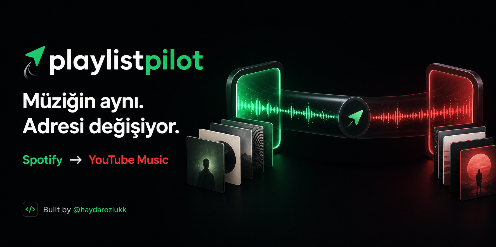
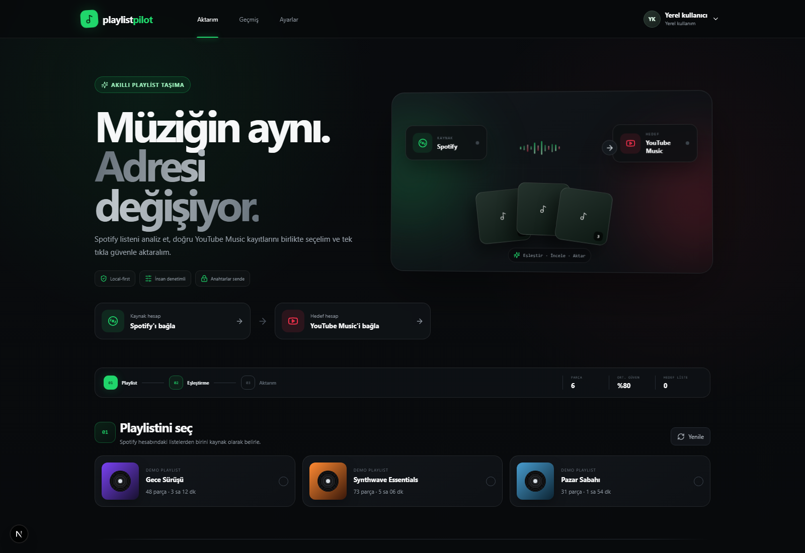

# Playlist Pilot



Spotify oynatma listelerini akıllı eşleştirme, kullanıcı denetimi ve gerçek OAuth bağlantılarıyla YouTube Music'e taşıyan local-first bir full-stack web uygulaması.

**Built by [@haydarozlukk](https://github.com/Haydarozlukk)**

## Ürün görünümü

[](./public/demo/playlist-pilot-demo.mp4)

▶ **[56 saniyelik ürün demosunu izle](./public/demo/playlist-pilot-demo.mp4)**

## Öne çıkanlar

- Gerçek Spotify ve Google OAuth bağlantısı
- Spotify çalma listelerini ve parçalarını doğrudan hesaptan yükleme
- YouTube Data API v3 ile müzik odaklı video arama
- Başlık, sanatçı, süre ve resmî kanal sinyallerini kullanan eşleştirme puanı
- Güvenilir sonuçları hızlı onaylama; şüpheli sonuçları alternatifleriyle inceleme
- Yeni gizli/listelenmemiş oynatma listesi oluşturma veya mevcut listeyi hedef seçme
- Seçilen parçaları gerçek YouTube oynatma listesine aktarma
- Tarayıcıda yerel aktarım geçmişi ve kullanıcı tercihleri
- Masaüstü ve mobil için duyarlı, premium ürün arayüzü

## Nasıl çalışır?

1. Spotify ve Google/YouTube hesaplarını bağla.
2. Kaynak Spotify oynatma listesini seç.
3. Otomatik eşleşmeleri incele ve gerekirse alternatifi değiştir.
4. Hedef listeyi seç veya yeni bir liste oluştur.
5. Aktarımı başlat ve sonucu doğrudan YouTube Music'te aç.

YouTube Music oynatma listeleri, YouTube oynatma listesi altyapısını kullandığı için aktarım resmî **YouTube Data API v3** üzerinden gerçekleştirilir.

## Yerel kurulum

Gereksinimler:

- Node.js 20 veya üzeri
- Spotify Developer uygulaması
- YouTube Data API v3 etkin bir Google Cloud projesi
- Google OAuth 2.0 Web Application istemcisi

PowerShell'de:

```powershell
npm install
powershell.exe -NoProfile -ExecutionPolicy Bypass -File ".\scripts\configure-local-env.ps1"
powershell.exe -NoProfile -ExecutionPolicy Bypass -File ".\scripts\configure-google-env.ps1"
npm run dev
```

Ardından [http://127.0.0.1:3000](http://127.0.0.1:3000) adresini aç.

### OAuth adresleri

Spotify Developer Dashboard içindeki redirect URI:

```text
http://127.0.0.1:3000/api/auth/spotify/callback
```

Google OAuth istemcisindeki JavaScript origin ve redirect URI:

```text
http://127.0.0.1:3000
http://127.0.0.1:3000/api/auth/google/callback
```

Google uygulaması test modundaysa kullanacağın Google hesabını **Audience > Test users** bölümüne ekle.

## API anahtarları hakkında

Bu repository'yi klonlayan herkes kendi Spotify ve Google OAuth bilgilerini `.env.local` dosyasına ekler. Son kullanıcıdan arayüz içinde API anahtarı istenmez ve repository hiçbir kişisel anahtar içermez.

## Güvenlik ve veri saklama

- Client ID ve client secret değerleri yalnızca `.env.local` içinde, sunucu tarafında tutulur.
- `.env.local`, OAuth token dosyaları ve gizli bilgiler Git tarafından yok sayılır.
- Spotify/Google access ve refresh tokenları yerel sunucu belleğinde tutulur; veritabanına veya buluta yazılmaz.
- Tarayıcı yalnızca rastgele, opak bir yerel oturum kimliği taşır.
- Sunucu yeniden başladığında hesap bağlantılarının yenilenmesi normaldir.
- Aktarım geçmişi ve tercihler yalnızca kullanıcının tarayıcısındaki `localStorage` alanında saklanır.

> Eski Python prototipinde kullanılan OAuth bilgileri daha önce Git geçmişine girdiyse ilgili Spotify/Google secret ve tokenlarını iptal edip yenilemek güvenli yaklaşımdır.

## Teknoloji

- Next.js 15 App Router
- React 19
- TypeScript
- Spotify Web API
- YouTube Data API v3
- Node.js yerleşik test runner
- Saf CSS ile özel responsive tasarım ve animasyonlar

## Test ve üretim derlemesi

```powershell
npm test
npx tsc --noEmit --incremental false
npm run build
```

## Proje yapısı

```text
app/          Sayfalar, OAuth callback'leri ve API route'ları
components/   Ana aktarım stüdyosu ve kullanıcı arayüzü
lib/          Spotify, YouTube, oturum ve eşleştirme katmanı
scripts/      PowerShell ortam kurulum yardımcıları
tests/        Eşleştirme motoru testleri
legacy/       İlk Python prototipi
public/       Sosyal paylaşım görseli, ürün demosu ve statik dosyalar
```

## Not

Bu sürüm, GitHub üzerinde incelenmesi ve geliştiricinin kendi OAuth uygulamalarıyla yerel olarak çalıştırması için tasarlanmıştır. Genel kullanıma açık çok kullanıcılı bir servis hâline getirmek; kalıcı veritabanı, şifreli token kasası, rate limiting, doğrulanmış OAuth uygulamaları ve barındırma katmanı gerektirir.

---

Tasarım ve geliştirme: **[@haydarozlukk](https://github.com/Haydarozlukk)**
